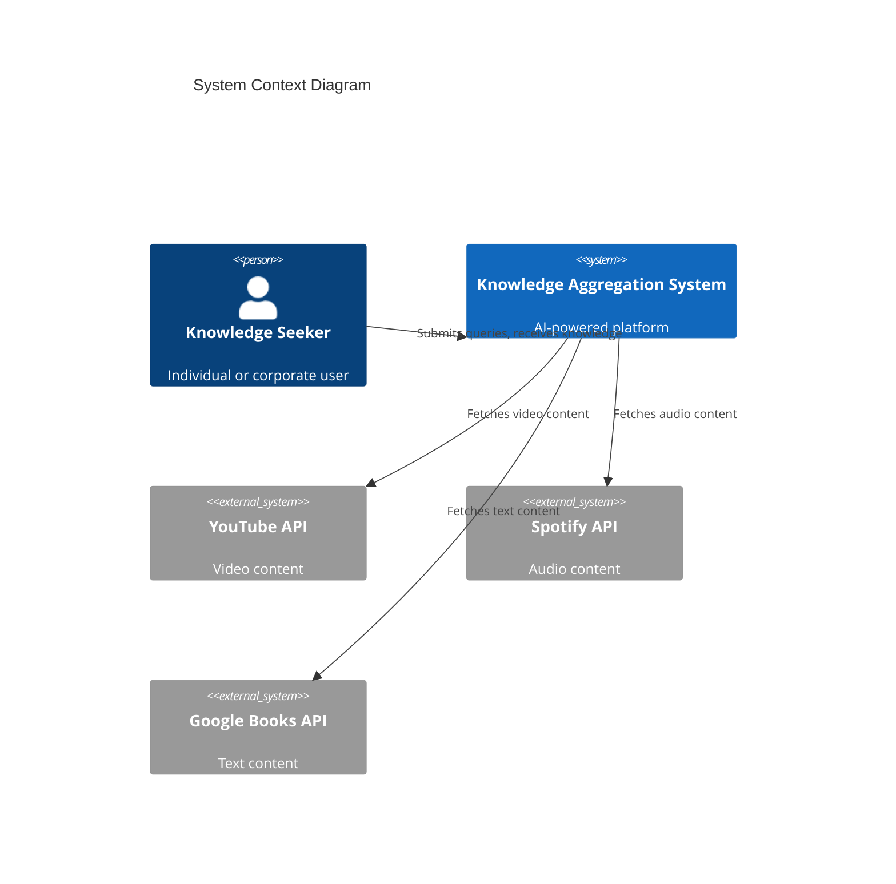
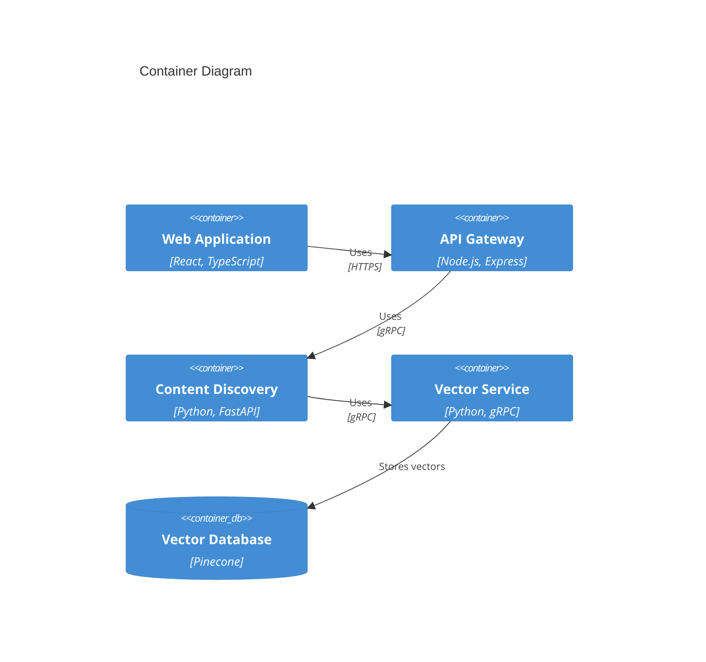

# AI-Powered Knowledge Aggregation System


An enterprise-grade AI-powered knowledge curation platform that transforms scattered information into structured, digestible knowledge through automated content discovery, intelligent organization, and personalized output generation.

## Project Overview

The AI-Powered Knowledge Aggregation System addresses the critical challenge of fragmented and overwhelming learning resources by providing an intelligent platform that reduces research time from hours to minutes. The system leverages advanced AI technologies including:

- Vector databases for semantic search
- Knowledge graphs for relationship mapping
- Multi-source content aggregation
- Intelligent content ranking and filtering

### Key Features

- **Content Discovery Engine**
  - Multi-source content aggregation
  - Quality assessment and ranking
  - Resource categorization
  - 90% relevance threshold

- **Vector Database Management**
  - Semantic search capabilities
  - Content clustering
  - Redundancy elimination
  - Sub-second query performance

- **Knowledge Organization Module**
  - Topic relationship mapping
  - Interactive knowledge graphs
  - Meta-model based structuring
  - Minimum 10 connections per topic

- **Output Generation Service**
  - Multimedia document creation
  - Personalized learning paths
  - Multiple export formats
  - Enterprise system integration

## Getting Started

### Prerequisites

- Docker 24.0+
- Kubernetes 1.28+
- Node.js 20 LTS
- Python 3.11+
- MongoDB 7.0+
- Redis 7.0+

### Installation

1. Clone the repository:
```bash
git clone https://github.com/yourusername/knowledge-aggregation-system.git
cd knowledge-aggregation-system
```

2. Set up environment variables:
```bash
cp .env.example .env
# Edit .env with your configuration
```

3. Start the development environment:
```bash
docker-compose up -d
```

4. Initialize the databases:
```bash
./scripts/init-db.sh
```

## Architecture

### System Context


### Container Architecture


## Development

### Local Development Environment

1. Install development dependencies:
```bash
npm install
pip install -r requirements-dev.txt
```

2. Start development services:
```bash
docker-compose -f docker-compose.dev.yml up
```

3. Run tests:
```bash
npm test
pytest
```

### Code Quality

- Linting: ESLint/Pylint
- Testing: Jest/Pytest
- Coverage: 85% minimum
- CI/CD: GitHub Actions

## Deployment

### Production Setup

1. Configure Kubernetes cluster:
```bash
kubectl apply -f k8s/
```

2. Deploy services:
```bash
helm install knowledge-system ./helm
```

### Monitoring

- Prometheus for metrics
- Grafana for visualization
- ELK Stack for logging
- PagerDuty for alerts

## Documentation

- [API Documentation](./docs/api.md)
- [Backend Services](./src/backend/README.md)
- [Frontend Guide](./src/frontend/README.md)
- [Deployment Guide](./docs/deployment.md)

## Contributing

Please read [CONTRIBUTING.md](CONTRIBUTING.md) for details on our code of conduct and the process for submitting pull requests.

### Development Workflow

1. Fork the repository
2. Create a feature branch
3. Commit changes
4. Submit pull request
5. Pass CI checks
6. Receive review and merge

## License

This project is licensed under the MIT License - see the [LICENSE](LICENSE) file for details.

## Support

- GitHub Issues for bug reports
- Discussions for feature requests
- Stack Overflow for implementation questions

## Project Status

- Build: Passing
- Coverage: 85%
- Version: 1.0.0
- Production Ready: Yes

---

Built with ❤️ by the Knowledge Aggregation Team