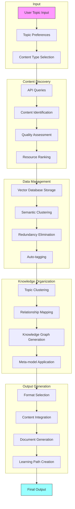
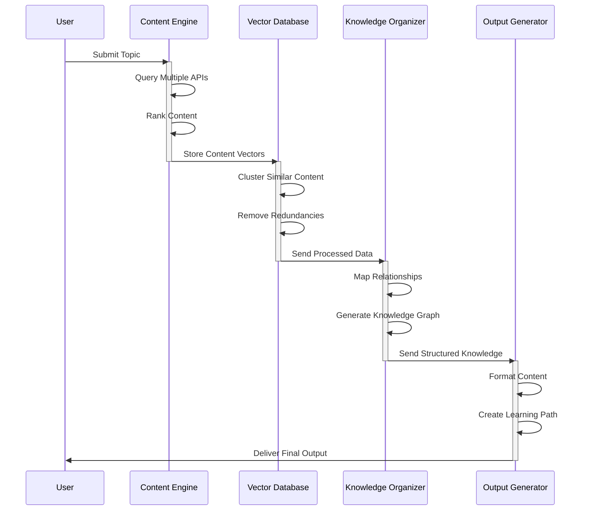
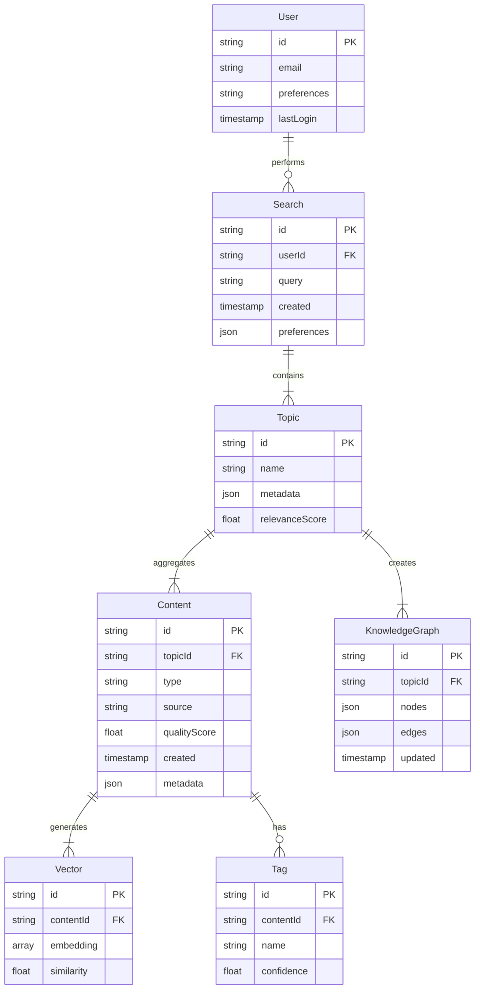
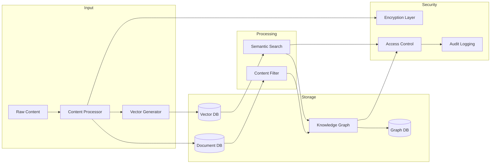
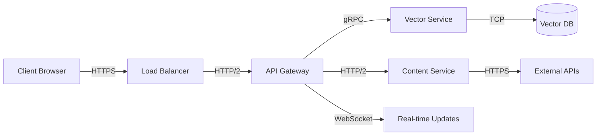
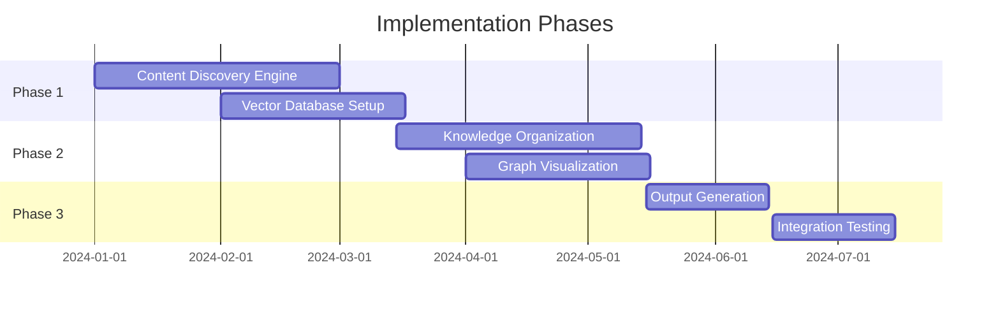

# Product Requirements Document (PRD)

# 1. INTRODUCTION

## 1.1 Purpose

This Software Requirements Specification (SRS) document provides a comprehensive description of the AI-powered knowledge aggregation and curation system. It serves as the primary reference for technical teams, stakeholders, and project managers involved in the development process. The document details functional and non-functional requirements, system architecture, and implementation specifications required to build a solution that transforms fragmented learning resources into structured, digestible knowledge.

## 1.2 Scope

The system will be a web-based platform that revolutionizes topic-based learning through intelligent content aggregation and organization. The core functionalities include:

- Automated discovery and ranking of high-quality multimedia content from diverse sources

  \- Perform comprehensive initial research upon receiving a new topic.

  \- Query APIs (Spotify, YouTube, Google Books, ArXiv, etc.) and scrape trusted sources for exhaustive coverage.

  \- Prioritize quality over speed by dedicating substantial processing time to ensure all relevant sources are considered before filtering.

  \- Cache results to avoid repeated API calls, enabling faster subsequent runs for the same topic.    
    
  Advanced data management using vector databases for semantic search capabilities

- ```
  - During the initial setup, allow extended processing time to:  
    - Rank content based on relevance, quality, and diversity.  
    - Apply multiple filtering passes to refine the dataset iteratively, ensuring minimal noise.  
    - Use advanced clustering techniques to organize data into well-defined subtopics.  
  - Prioritize recall (finding all relevant information) over precision initially, followed by filtering to achieve optimal balance.  
  ```

- AI-powered knowledge organization and meta-modeling

- Interactive knowledge graph visualization

- Customizable multimedia output generation in structured formats

- - For the initial topic report, prioritize comprehensive research and insight generation over speed.

  \- Allow the system to perform multiple iterations on summary drafts, ensuring the most relevant, well-organized insights are presented.

  \- Subsequent updates or refreshes for the same topic should emphasize speed by leveraging pre-cached and previously processed data.

Key benefits:

- Reduces research time from hours/days to minutes
- Provides comprehensive topic coverage across multiple content types
- Ensures quality through algorithmic content ranking and filtering
- Delivers personalized learning experiences
- Enables efficient knowledge sharing for both individuals and organizations

  ```
  Initial Research Mode:
  - When given a new topic, the tool enters an in-depth research mode:  
    - Allocates substantial resources to gather, analyze, and organize all possible information.  
    - Runs multiple processing layers to evaluate content quality, eliminate redundancies, and generate meaningful relationships.  
    - Flags gaps in available data and suggests alternative searches or related topics if necessary.  
  - Include a progress indicator (e.g., "Research in Progress: 75% complete") to manage user expectations for the extended processing time.  
  - Output a summary of research decisions and criteria used for content selection to enhance transparency and trust.  
  ```

The system will support:

- Individual knowledge seekers (students, professionals, researchers)
- Corporate teams requiring rapid knowledge acquisition
- Content creators and subject matter experts
- Educational institutions and research organizations

Out of scope:

- Original content creation
- Real-time collaborative editing
- Social networking features
- Content hosting/storage services

# 2. PRODUCT DESCRIPTION

## 2.1 Product Perspective

The AI-powered knowledge aggregation system operates as a standalone web-based platform that integrates with multiple external services and data sources:

- Content APIs: YouTube, Spotify, Google Books, academic databases
- Vector Database Systems: Pinecone/Weaviate for semantic data storage
- Output Platforms: Notion, Markdown-compatible systems
- Visualization Libraries: D3.js/Cytoscape for knowledge graphs

The system architecture follows a modular design with four primary components:

1. Content Discovery Engine
2. Vector Database Management System
3. Knowledge Organization Module
4. Output Generation Service

## 2.2 Product Functions

The core functions of the system include:

1. Automated Content Discovery

   - Multi-source content identification
   - Quality assessment and ranking
   - Resource categorization and metadata extraction

2. Intelligent Data Management

   - Semantic vector storage
   - Redundancy elimination
   - Auto-tagging and classification

3. Knowledge Organization

   - Topic clustering and relationship mapping
   - Interactive knowledge graph generation
   - Meta-model based content structuring

4. Customized Output Generation

   - Multi-format document creation
   - Personalized learning path development
   - Multimedia content integration

## 2.3 User Characteristics

| User Type | Characteristics | Technical Expertise | Usage Pattern |
| --- | --- | --- | --- |
| Individual Knowledge Seekers | Students, professionals, researchers | Basic to intermediate | Regular, focused research sessions |
| Corporate Teams | Business analysts, research teams | Intermediate | Heavy batch processing, team sharing |
| Content Creators | Subject matter experts, educators | Varied | Content organization, knowledge structuring |
| Educational Institutions | Faculty, librarians | Intermediate to advanced | Large-scale knowledge management |

## 2.4 Constraints

Technical Constraints:

- API rate limits from content providers
- Vector database scaling limitations
- Processing time requirements (max 5 seconds per content item)
- Browser compatibility requirements

Regulatory Constraints:

- GDPR and data privacy compliance
- Content copyright restrictions
- Academic citation requirements

Business Constraints:

- Development budget limitations
- Third-party service costs
- Storage capacity restrictions

## 2.5 Assumptions and Dependencies

Assumptions:

- Stable internet connectivity for content aggregation
- Availability of quality content sources
- User access to modern web browsers
- Basic user familiarity with search interfaces

Dependencies:

- External API availability and stability
- Vector database service uptime
- Content provider partnerships
- Third-party visualization library support
- Browser compatibility with knowledge graph rendering
- Notion API for output generation

# 3. PROCESS FLOWCHART





# 4. FUNCTIONAL REQUIREMENTS

## 4.1 Content Discovery & Aggregation

### ID: F1

### Description

System capability to automatically discover, evaluate, and aggregate content from multiple sources.

### Priority: High

| Requirement ID | Requirement Description | Acceptance Criteria |
| --- | --- | --- |
| F1.1 | Multi-source content querying | - Successfully query YouTube, Spotify, Google Books, and academic databases APIs<br>- Handle API rate limits gracefully<br>- Process minimum 100 sources per topic |
| F1.2 | Quality assessment | - Calculate impact scores based on citations, engagement metrics<br>- Identify and rank top researchers/influencers<br>- Maintain 90% relevance threshold |
| F1.3 | Resource categorization | - Classify content by type (video, audio, text)<br>- Extract and validate metadata<br>- Tag with source credibility scores |

## 4.2 Data Management & Filtering

### ID: F2

### Description

Vector database implementation for semantic search and content organization.

### Priority: High

| Requirement ID | Requirement Description | Acceptance Criteria |
| --- | --- | --- |
| F2.1 | Vector storage | - Successfully store vectors in Pinecone/Weaviate<br>- Maintain sub-second query response time<br>- Support minimum 1M vectors |
| F2.2 | Content filtering | - Remove duplicate content with 95% accuracy<br>- Filter low-quality content based on defined metrics<br>- Cluster similar content items |
| F2.3 | Automated tagging | - Generate relevant topic tags<br>- Extract key entities and relationships<br>- Maintain taxonomy consistency |

## 4.3 Knowledge Organization

### ID: F3

### Description

AI-powered knowledge structuring and visualization system.

### Priority: Medium

| Requirement ID | Requirement Description | Acceptance Criteria |
| --- | --- | --- |
| F3.1 | Topic clustering | - Group related concepts automatically<br>- Identify hierarchical relationships<br>- Generate minimum 10 connections per topic |
| F3.2 | Knowledge graph generation | - Create interactive D3.js/Cytoscape visualizations<br>- Support zoom/pan interactions<br>- Display node details on demand |
| F3.3 | Meta-model application | - Apply consistent knowledge structure<br>- Generate logical topic groupings<br>- Create concept hierarchies |

## 4.4 Output Generation

### ID: F4

### Description

Customizable document and learning path creation system.

### Priority: Medium

| Requirement ID | Requirement Description | Acceptance Criteria |
| --- | --- | --- |
| F4.1 | Document creation | - Generate Notion-compatible outputs<br>- Include multimedia embeddings<br>- Complete generation within 5 seconds per item |
| F4.2 | Learning path development | - Create personalized learning sequences<br>- Adapt to user preferences<br>- Include difficulty progression |
| F4.3 | Export functionality | - Support multiple export formats<br>- Include source citations<br>- Maintain formatting consistency |

## 4.5 User Interaction

### ID: F5

### Description

User interface and preference management system.

### Priority: Medium

| Requirement ID | Requirement Description | Acceptance Criteria |
| --- | --- | --- |
| F5.1 | Topic search | - Provide autocomplete suggestions<br>- Handle complex queries<br>- Return results within 2 seconds |
| F5.2 | Preference management | - Store user content preferences<br>- Allow depth/breadth customization<br>- Save search history |
| F5.3 | Interactive exploration | - Enable sub-topic drilling<br>- Support related concept discovery<br>- Provide real-time feedback |

# 5. NON-FUNCTIONAL REQUIREMENTS

## 5.1 Performance

| Requirement | Description | Target Metric |
| --- | --- | --- |
| Response Time | Maximum time for search results | \< 2 seconds |
| Content Processing | Time to process new content items | \< 5 seconds per item |
| Vector Search | Query response time for semantic search | \< 100ms |
| Knowledge Graph Rendering | Time to generate and display visualization | \< 3 seconds |
| API Integration | Maximum time for external API calls | \< 1 second per call |
| Concurrent Users | Number of simultaneous users supported | 10,000 minimum |
| Database Operations | Vector database query throughput | 1000 QPS |

## 5.2 Safety

| Requirement | Description | Implementation |
| --- | --- | --- |
| Data Backup | Regular automated backups | Daily incremental, weekly full |
| Failure Recovery | System recovery procedures | Maximum 4-hour recovery time |
| Data Redundancy | Geographic data replication | Minimum 3 locations |
| Error Handling | Graceful degradation of services | Fallback to cached results |
| Input Validation | Sanitization of user inputs | All inputs validated server-side |
| System Monitoring | Real-time system health tracking | 24/7 automated monitoring |
| Fault Tolerance | Service continuity during component failures | 99.9% uptime guarantee |

## 5.3 Security

| Requirement | Description | Standard/Method |
| --- | --- | --- |
| Authentication | User identity verification | OAuth 2.0, JWT tokens |
| Authorization | Role-based access control | RBAC implementation |
| Data Encryption | Protection of stored data | AES-256 at rest |
| Transport Security | Secure data transmission | TLS 1.3 |
| API Security | Protection of API endpoints | Rate limiting, API keys |
| Session Management | Secure user sessions | 30-minute timeout |
| Audit Logging | Security event tracking | Complete audit trail |

## 5.4 Quality

### 5.4.1 Availability

- System uptime: 99.9% excluding planned maintenance
- Maximum planned downtime: 4 hours per month
- Unplanned downtime resolution: \< 2 hours

### 5.4.2 Maintainability

- Modular architecture with clear separation of concerns
- Comprehensive API documentation
- Automated deployment pipeline
- Code coverage minimum: 80%

### 5.4.3 Usability

- Maximum 3 clicks to reach any feature
- Mobile-responsive design
- Support for major browsers (Chrome, Firefox, Safari, Edge)
- Accessibility compliance with WCAG 2.1 Level AA

### 5.4.4 Scalability

- Horizontal scaling capability up to 100 nodes
- Support for 1M+ vector database entries
- Auto-scaling based on load metrics
- Cache hit ratio \> 90%

### 5.4.5 Reliability

- Mean Time Between Failures (MTBF): \> 720 hours
- Mean Time To Recovery (MTTR): \< 30 minutes
- Error rate: \< 0.1% of all requests
- Data consistency check frequency: Daily

## 5.5 Compliance

| Requirement | Standard/Regulation | Implementation |
| --- | --- | --- |
| Data Privacy | GDPR, CCPA | User consent management, data deletion capabilities |
| Content Rights | DMCA | Copyright verification system |
| Accessibility | WCAG 2.1 | Screen reader support, keyboard navigation |
| API Standards | REST/OpenAPI | Standardized API documentation |
| Data Storage | ISO 27001 | Certified data center usage |
| Citations | Academic Standards | Automated citation generation |
| Documentation | Technical Writing | IEEE documentation standards |

# 6. DATA REQUIREMENTS

## 6.1 Data Models



## 6.2 Data Storage

### 6.2.1 Primary Storage Systems

- Vector Database: Pinecone/Weaviate for semantic embeddings
- Document Store: MongoDB for user data and content metadata
- Graph Database: Neo4j for knowledge graph relationships
- Cache Layer: Redis for frequently accessed data

### 6.2.2 Data Retention

| Data Type | Retention Period | Storage Location |
| --- | --- | --- |
| User Data | Indefinite | MongoDB |
| Search History | 12 months | MongoDB |
| Content Vectors | 6 months | Pinecone/Weaviate |
| Knowledge Graphs | 3 months | Neo4j |
| Cache Data | 24 hours | Redis |

### 6.2.3 Redundancy & Backup

- Geographic Replication: 3 regions minimum
- Backup Schedule:
  - Hourly incremental backups
  - Daily full backups
  - Weekly archival backups
- Recovery Point Objective (RPO): 1 hour
- Recovery Time Objective (RTO): 4 hours

## 6.3 Data Processing



### 6.3.1 Data Security

| Security Layer | Implementation | Purpose |
| --- | --- | --- |
| Encryption at Rest | AES-256 | Protect stored data |
| Encryption in Transit | TLS 1.3 | Secure data transmission |
| Access Control | RBAC | Manage data access |
| Data Masking | Dynamic masking | Protect sensitive fields |
| Audit Trail | Continuous logging | Track data access |

### 6.3.2 Data Processing Requirements

- Vector Generation: Maximum 100ms per content item
- Content Processing: 5 documents per second
- Batch Processing: 10,000 items per hour
- Query Performance: Sub-second response time
- Concurrent Processing: 100 parallel operations

### 6.3.3 Data Quality Standards

| Metric | Requirement | Validation Method |
| --- | --- | --- |
| Completeness | 95% required fields | Automated validation |
| Accuracy | 98% confidence score | ML model verification |
| Consistency | 100% schema compliance | Schema enforcement |
| Uniqueness | Zero duplicates | Hash comparison |
| Timeliness | Max 5min processing delay | Timestamp monitoring |

# 7. EXTERNAL INTERFACES

## 7.1 User Interfaces

### 7.1.1 Web Application Interface

- Responsive design supporting viewport sizes from 320px to 4K
- Primary navigation:
  - Topic search bar with autocomplete
  - Knowledge graph visualization area
  - Content filter sidebar
  - Output format selector
  - User preferences panel

### 7.1.2 Interface Requirements

| Component | Requirements | Interactions |
| --- | --- | --- |
| Search Bar | - Autocomplete suggestions<br>- Search history display<br>- Filter toggles | Real-time suggestions within 200ms |
| Knowledge Graph | - Zoomable canvas<br>- Node selection<br>- Edge highlighting | Pan/zoom with mouse/touch gestures |
| Content Filters | - Checkbox categories<br>- Slider controls<br>- Tag selection | Instant filter application |
| Output Panel | - Format templates<br>- Preview window<br>- Export options | Live preview updates |

## 7.2 Software Interfaces

### 7.2.1 External APIs

| Service | Interface Type | Purpose | Data Format |
| --- | --- | --- | --- |
| YouTube API | REST | Video content retrieval | JSON |
| Spotify API | REST | Podcast content access | JSON |
| Google Books API | REST | Book metadata and previews | JSON |
| Notion API | REST | Output generation | JSON |
| Pinecone/Weaviate | gRPC | Vector database operations | Protocol Buffers |
| Neo4j | Bolt | Graph database operations | Binary |

### 7.2.2 Internal Services

| Service | Protocol | Port | Purpose |
| --- | --- | --- | --- |
| Content Discovery Service | HTTP/2 | 8001 | Content aggregation |
| Vector Service | gRPC | 8002 | Embedding operations |
| Knowledge Graph Service | HTTP/2 | 8003 | Graph generation |
| Output Service | HTTP/2 | 8004 | Document creation |

## 7.3 Communication Interfaces

### 7.3.1 Network Protocols

| Protocol | Usage | Configuration |
| --- | --- | --- |
| HTTPS | Client-server communication | TLS 1.3 |
| WebSocket | Real-time updates | WSS protocol |
| gRPC | Service-to-service communication | HTTP/2 |
| Redis Pub/Sub | Event messaging | TCP/6379 |

### 7.3.2 Data Exchange Formats

| Format | Purpose | Schema Validation |
| --- | --- | --- |
| JSON | REST API responses | JSON Schema |
| Protocol Buffers | gRPC messages | .proto files |
| GraphQL | Query language | GraphQL Schema |
| MessagePack | Binary data transfer | Custom validators |

### 7.3.3 Integration Points



## 7.4 Hardware Interfaces

### 7.4.1 Storage Requirements

| Component | Interface Type | Specifications |
| --- | --- | --- |
| SSD Storage | NVMe | Min 1TB, 3000MB/s read |
| Memory | DDR4 | Min 32GB, ECC support |
| Network | 10GbE | Full duplex, jumbo frames |

### 7.4.2 Processing Requirements

| Component | Specifications | Purpose |
| --- | --- | --- |
| CPU | 16+ cores, AVX-512 | Vector operations |
| GPU | CUDA-compatible | ML model inference |
| Network Cards | SR-IOV support | Virtual interface isolation |

# 8. APPENDICES

## 8.1 GLOSSARY

| Term | Definition |
| --- | --- |
| Vector Database | A database that stores data as high-dimensional vectors, enabling semantic search and similarity matching |
| Knowledge Graph | A network representation of entities and their relationships using nodes and edges |
| Meta-model | A framework for organizing and structuring knowledge in a consistent, hierarchical manner |
| Semantic Search | Search technique that understands contextual meaning rather than just keywords |
| Content Curation | Process of gathering, organizing, and filtering content based on quality and relevance |
| Vector Embedding | Numerical representation of content that captures semantic meaning in high-dimensional space |

## 8.2 ACRONYMS

| Acronym | Full Form |
| --- | --- |
| API | Application Programming Interface |
| RBAC | Role-Based Access Control |
| GDPR | General Data Protection Regulation |
| CCPA | California Consumer Privacy Act |
| DMCA | Digital Millennium Copyright Act |
| JWT | JSON Web Token |
| TLS | Transport Layer Security |
| WCAG | Web Content Accessibility Guidelines |
| QPS | Queries Per Second |
| MTBF | Mean Time Between Failures |
| MTTR | Mean Time To Recovery |
| RPO | Recovery Point Objective |
| RTO | Recovery Time Objective |
| NLP | Natural Language Processing |

## 8.3 ADDITIONAL REFERENCES

| Resource | Description | URL |
| --- | --- | --- |
| Vector Database Documentation | Pinecone technical documentation | https://docs.pinecone.io |
| Knowledge Graph Libraries | D3.js and Cytoscape documentation | https://d3js.org, https://cytoscape.org |
| API Integration Guides | YouTube, Spotify, Google Books APIs | https://developers.google.com/youtube |
| Notion API Reference | Integration documentation for output generation | https://developers.notion.com |
| GDPR Compliance Guide | Data privacy implementation guidelines | https://gdpr.eu/compliance |
| IEEE Documentation Standards | Technical writing guidelines | https://standards.ieee.org |

## 8.4 TESTING SCENARIOS

| Category | Test Case | Expected Outcome |
| --- | --- | --- |
| Content Discovery | Search "Quantum Computing" | Minimum 100 relevant and diverse sources across at least 3 media types (articles, videos, podcasts). |
| Vector Operations | Similarity search for related topics | Sub-second response with 95% relevance, clustered by subtopics. |
| Knowledge Graph | Generate topic relationships | Minimum 10 meaningful and distinct connections that are dynamically visualized. |
| Output Generation | Create Notion document | Complete within 5 seconds, including:Proper embedding of videos, Clickable links, Expandable FAQs. |
| Performance | Concurrent user simulation | Consistent response times under 2 seconds. |
| User Experience | A novice user explores the topic “Blockchain” | User identifies a structured learning path within 3 clicks and finds key resources easily. |
| Edge Cases | Input a misspelled query like “Quamtum Computing” | System either corrects the query or suggests the closest relevant topics. |
| Initial Research Mode | Input "Decentralized AI" as a new topic | 1. The tool dedicates sufficient time (e.g., up to 10 minutes) to identify and analyze 200+ diverse and high-quality sources. and 2. Outputs a summary of research steps, including the number of sources reviewed, filtering criteria applied, and reasons for excluding irrelevant content. |

## 8.5 IMPLEMENTATION TIMELINE

