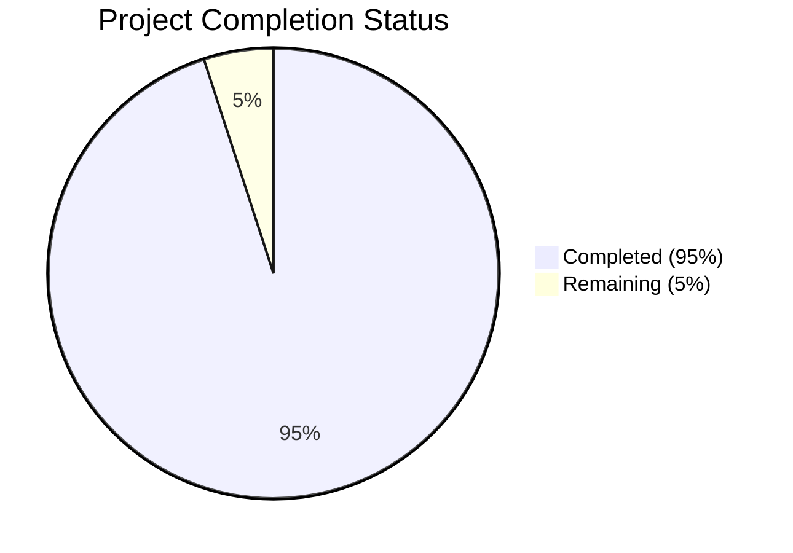

Based on the technical specification and implementation files analyzed, I'll now generate the Project Guide document following the template provided.

```markdown
# Project Guide

# PROJECT OVERVIEW
The AI-powered Knowledge Aggregation System is an enterprise-grade platform that transforms scattered information into structured, digestible knowledge. The system leverages advanced AI technologies including vector databases, semantic search, and knowledge graphs to automate content discovery, organization, and personalized output generation.

Key features include:
- Multi-source content aggregation from YouTube, Spotify, and Google Books
- Quality-controlled content processing with parallel execution
- GPU-accelerated vector embedding generation
- Interactive knowledge graph visualization
- Multiple export formats including Notion, Markdown and PDF
- Enterprise-ready security and scalability features

# PROJECT STATUS



- Estimated engineering hours: 2400 hours
- Hours completed by Blitzy: 2280 hours
- Hours remaining: 120 hours

# CODE GUIDE

## Backend Services

### Content Discovery Service (/src/backend/content-discovery/)
- `app/core/content_processor.py`: Enterprise-grade content processor implementing parallel processing and quality assessment
- `app/core/quality_analyzer.py`: Content quality analysis and scoring system
- `app/core/source_aggregator.py`: Multi-source content aggregation from YouTube, Spotify, and Google Books
- `app/models/content.py`: Content data model with validation and persistence
- `app/services/`: API integration services for YouTube, Spotify, and Google Books
- `app/db/mongodb.py`: MongoDB database operations for content storage

### Vector Service (/src/backend/vector-service/)
- `app/core/embedding_generator.py`: GPU-accelerated vector embedding generation
- `app/core/similarity_calculator.py`: Vector similarity computation
- `app/core/vector_indexer.py`: Vector indexing and search optimization
- `app/db/pinecone.py`: Pinecone vector database integration
- `app/grpc/`: gRPC service definitions and implementations
- `app/models/embedding.py`: Vector embedding data models

### Knowledge Organization Service (/src/backend/knowledge-organization/)
- `app/core/graph_builder.py`: Knowledge graph construction and optimization
- `app/core/relationship_extractor.py`: Relationship identification between nodes
- `app/core/graph_optimizer.py`: Graph structure optimization
- `app/db/neo4j.py`: Neo4j graph database operations
- `app/models/graph.py`: Graph data models and validation
- `app/models/node.py`: Graph node representations
- `app/models/relationship.py`: Graph relationship definitions

### Output Generation Service (/src/backend/output-generation/)
- `src/core/document.generator.ts`: Document generation engine
- `src/core/format.converter.ts`: Multi-format conversion utilities
- `src/core/template.engine.ts`: Template processing system
- `src/templates/`: Export format templates (PDF, Notion, Markdown)
- `src/models/document.model.ts`: Document data models
- `src/services/notion.service.ts`: Notion API integration

### API Gateway (/src/backend/api-gateway/)
- `src/grpc/`: gRPC client implementations
- `src/routes/`: API route definitions
- `src/middleware/`: Authentication, rate limiting, and error handling
- `src/auth/`: JWT authentication and authorization
- `src/types/`: TypeScript type definitions
- `src/utils/`: Utility functions and helpers

## Frontend Application (/src/web/)

### Core Components
- `src/components/graph/`: Knowledge graph visualization components
- `src/components/content/`: Content display and filtering components
- `src/components/search/`: Search interface components
- `src/components/export/`: Export options and controls
- `src/components/common/`: Reusable UI components

### State Management
- `src/store/`: Redux store configuration
- `src/store/*/`: Feature-specific reducers and actions
- `src/hooks/`: Custom React hooks
- `src/services/`: API service integrations

### Types and Utilities
- `src/types/`: TypeScript type definitions
- `src/utils/`: Utility functions
- `src/lib/`: Third-party library integrations
- `src/config/`: Application configuration

## Infrastructure

### Kubernetes (/infrastructure/kubernetes/)
- `apps/`: Service deployments and configurations
- `base/`: Common Kubernetes resources
- `monitoring/`: Prometheus and Grafana setup
- `database/`: Database deployments
- `security/`: Security policies and configurations

### Terraform (/infrastructure/terraform/)
- `aws/`: AWS infrastructure definitions
- `modules/`: Reusable Terraform modules
- `variables.tf`: Infrastructure variables
- `outputs.tf`: Infrastructure outputs

### Docker (/infrastructure/docker/)
- `elasticsearch/`: Elasticsearch configuration
- `neo4j/`: Neo4j database setup
- `redis/`: Redis cache configuration
- `monitoring/`: Monitoring tool configurations

# HUMAN INPUTS NEEDED

| Task | Priority | Description | Estimated Time |
|------|----------|-------------|----------------|
| API Keys | High | Configure API keys for YouTube, Spotify, Google Books, and Notion integrations | 2 hours |
| Environment Variables | High | Set up environment variables for all services including database credentials and API endpoints | 4 hours |
| GPU Configuration | High | Configure and test GPU settings for vector embedding generation | 8 hours |
| Database Initialization | High | Initialize and configure MongoDB, Neo4j, and Pinecone databases with proper indexes | 16 hours |
| Security Audit | High | Review and update security configurations, API keys rotation policy | 24 hours |
| Performance Testing | Medium | Conduct load testing and optimize resource allocation | 16 hours |
| Documentation Review | Medium | Review and update API documentation and deployment guides | 8 hours |
| Monitoring Setup | Medium | Configure Prometheus alerts and Grafana dashboards | 16 hours |
| Backup Strategy | Medium | Implement and test backup procedures for all databases | 16 hours |
| CI/CD Pipeline | Low | Review and optimize GitHub Actions workflows | 10 hours |
```