# Technical Specifications

# 1. INTRODUCTION

## 1.1 Executive Summary

The AI-powered knowledge aggregation and curation system addresses the critical challenge of fragmented and overwhelming learning resources by providing an intelligent platform that transforms scattered information into structured, digestible knowledge. This system enables knowledge seekers, corporate teams, and educational institutions to reduce research time from hours or days to minutes through automated content discovery, intelligent organization, and personalized output generation.

The solution leverages advanced AI technologies including vector databases, semantic search, and knowledge graphs to deliver comprehensive topic coverage while maintaining high quality standards through algorithmic content ranking and filtering. By automating the research and curation process, users can focus on understanding and applying knowledge rather than gathering it.

## 1.2 System Overview

### Project Context

| Aspect | Description |
|--------|-------------|
| Market Position | First-to-market AI-powered knowledge curation platform focusing on multi-source aggregation and semantic organization |
| Current Limitations | Traditional research methods require manual source identification, quality assessment, and content organization |
| Enterprise Integration | Seamless integration with existing knowledge management systems through standardized APIs and export capabilities |

### High-Level Description

The system comprises four primary components:

1. Content Discovery Engine
   - Multi-source content aggregation
   - Quality assessment and ranking
   - Resource categorization

2. Vector Database Management
   - Semantic search capabilities
   - Content clustering
   - Redundancy elimination

3. Knowledge Organization Module
   - Topic relationship mapping
   - Interactive knowledge graphs
   - Meta-model based structuring

4. Output Generation Service
   - Multimedia document creation
   - Personalized learning paths
   - Multiple export formats

### Success Criteria

| Metric | Target |
|--------|---------|
| Content Relevance | 90% relevance threshold |
| Processing Speed | < 5 seconds per content item |
| Knowledge Graph Complexity | Minimum 10 connections per topic |
| User Satisfaction | > 85% positive feedback |
| System Availability | 99.9% uptime |

## 1.3 Scope

### In-Scope Elements

| Category | Components |
|----------|------------|
| Core Features | - Automated content discovery and ranking<br>- Semantic vector storage and search<br>- Knowledge graph visualization<br>- Personalized output generation |
| User Groups | - Individual knowledge seekers<br>- Corporate research teams<br>- Educational institutions<br>- Content creators |
| Data Types | - Articles and academic papers<br>- Video content<br>- Podcasts and audio<br>- Books and publications |
| Technical Coverage | - API integrations<br>- Vector database implementation<br>- Knowledge graph generation<br>- Output formatting |

### Out-of-Scope Elements

- Original content creation capabilities
- Real-time collaborative editing features
- Social networking functionality
- Content hosting services
- Direct content monetization
- Third-party content modification
- Real-time language translation
- Custom content creation tools

# 2. SYSTEM ARCHITECTURE

## 2.1 High-Level Architecture

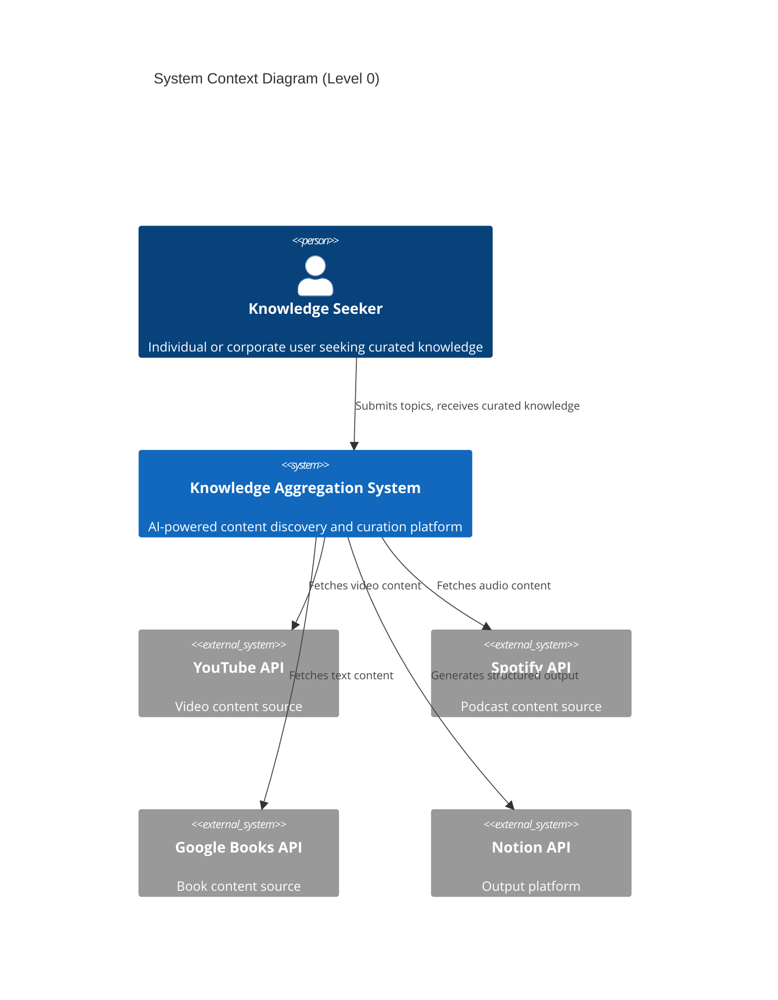

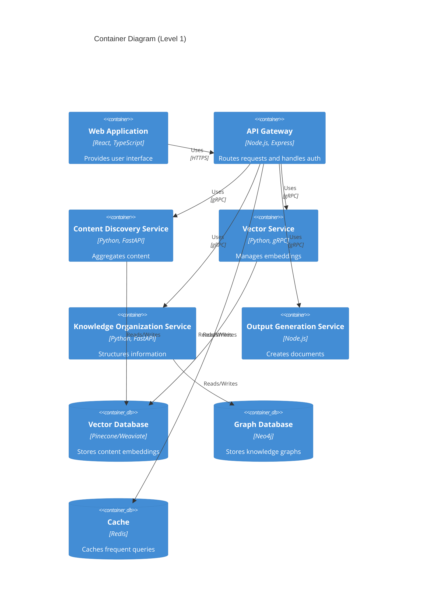

## 2.2 Component Details

### 2.2.1 Core Components

| Component | Purpose | Technologies | Scaling Strategy |
|-----------|---------|--------------|------------------|
| Content Discovery Service | Content aggregation and ranking | Python, FastAPI, Celery | Horizontal scaling with worker pools |
| Vector Service | Embedding generation and similarity search | Python, gRPC, TensorFlow | GPU-enabled instances, distributed processing |
| Knowledge Organization Service | Topic mapping and graph generation | Python, FastAPI, NetworkX | Vertical scaling for graph processing |
| Output Generation Service | Document creation and formatting | Node.js, Handlebars | Queue-based processing with auto-scaling |

### 2.2.2 Data Storage Components

| Component | Technology | Purpose | Scaling Approach |
|-----------|------------|---------|------------------|
| Vector Database | Pinecone/Weaviate | Semantic search | Cloud-native horizontal scaling |
| Graph Database | Neo4j | Knowledge relationships | Read replicas, sharding |
| Cache Layer | Redis | Query caching | Cluster mode with sharding |
| Document Store | MongoDB | Metadata storage | Replica sets with sharding |

## 2.3 Technical Decisions

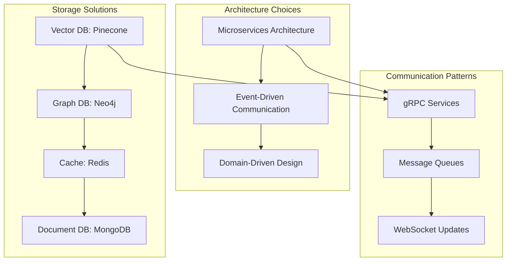

### 2.3.1 Architecture Justification

| Decision | Rationale | Trade-offs |
|----------|-----------|------------|
| Microservices | Independent scaling, technology flexibility | Increased operational complexity |
| Event-Driven | Asynchronous processing, loose coupling | Event consistency management |
| gRPC Communication | High performance, strong typing | Limited browser support |

## 2.4 Cross-Cutting Concerns

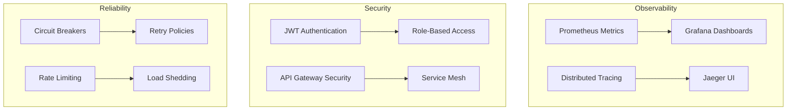

### 2.4.1 Monitoring Strategy

| Aspect | Implementation | Tools |
|--------|----------------|-------|
| Metrics | System and business metrics collection | Prometheus, Grafana |
| Logging | Structured logging with correlation IDs | ELK Stack |
| Tracing | Distributed request tracing | Jaeger |
| Alerting | Automated alert generation | PagerDuty |

## 2.5 Deployment Architecture

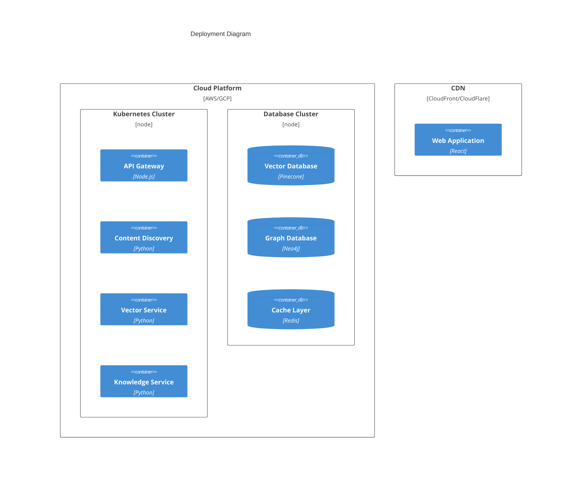

# 3. SYSTEM COMPONENTS ARCHITECTURE

## 3.1 User Interface Design

### 3.1.1 Design System Specifications

| Component | Specification | Implementation Details |
|-----------|--------------|----------------------|
| Typography | System fonts | Primary: Inter, Fallback: -apple-system |
| Color Palette | WCAG 2.1 AA compliant | Primary: #2563EB, Secondary: #64748B |
| Spacing System | 4px base unit | Increments: 4, 8, 16, 24, 32, 48, 64px |
| Breakpoints | Mobile-first | xs: 320px, sm: 640px, md: 768px, lg: 1024px, xl: 1280px |
| Component Library | React-based | Material UI v5 with custom theming |
| Accessibility | WCAG 2.1 Level AA | ARIA labels, keyboard navigation, screen reader support |

### 3.1.2 Layout Structure

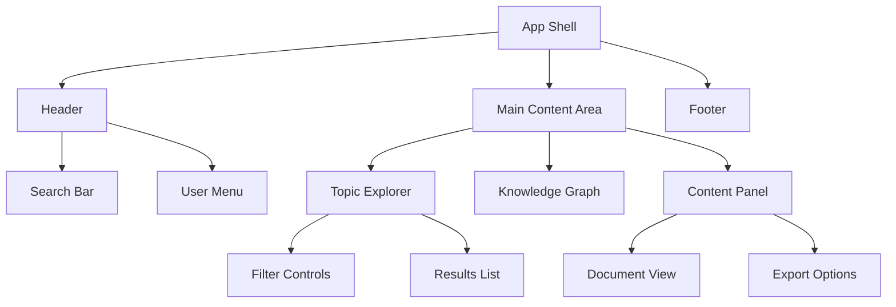

### 3.1.3 Critical User Flows

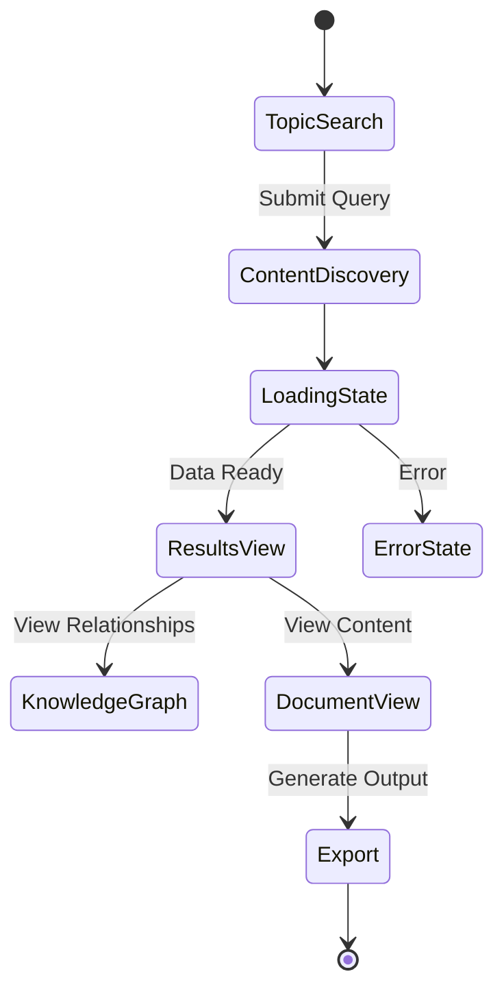

### 3.1.4 Responsive Design Matrix

| Component | Mobile (<640px) | Tablet (640-1024px) | Desktop (>1024px) |
|-----------|----------------|---------------------|-------------------|
| Navigation | Hamburger menu | Sidebar collapsible | Persistent sidebar |
| Search Bar | Full width | Centered, 70% width | Centered, 50% width |
| Knowledge Graph | List view | Interactive, scaled | Full interactive |
| Content Panel | Full screen | 60% width | 40% width |
| Controls | Bottom sheet | Inline | Inline with advanced options |

## 3.2 Database Design

### 3.2.1 Data Models

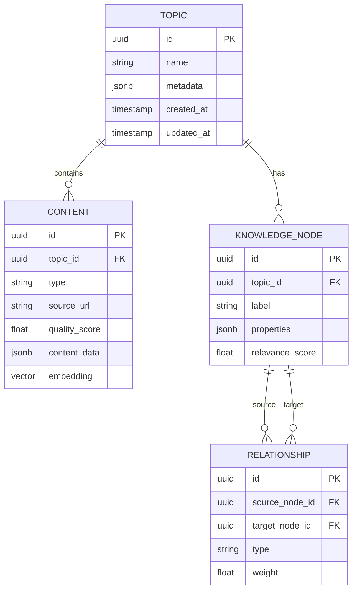

### 3.2.2 Storage Strategy

| Database Type | Purpose | Technology | Scaling Strategy |
|---------------|---------|------------|------------------|
| Vector Store | Content embeddings | Pinecone | Horizontal sharding |
| Graph Database | Knowledge relationships | Neo4j | Read replicas |
| Document Store | Metadata & user data | MongoDB | Sharding by topic |
| Cache Layer | Frequent queries | Redis | Cluster mode |

### 3.2.3 Data Management Policies

| Aspect | Policy | Implementation |
|--------|--------|----------------|
| Backup Schedule | Daily incremental, Weekly full | Automated cloud backups |
| Data Retention | Content: 6 months, Logs: 30 days | Time-based partitioning |
| Privacy Controls | PII encryption, Data masking | Column-level encryption |
| Audit Logging | All write operations | CDC with MongoDB |
| Archival Strategy | Cold storage after 6 months | AWS S3 Glacier |

## 3.3 API Design

### 3.3.1 API Architecture

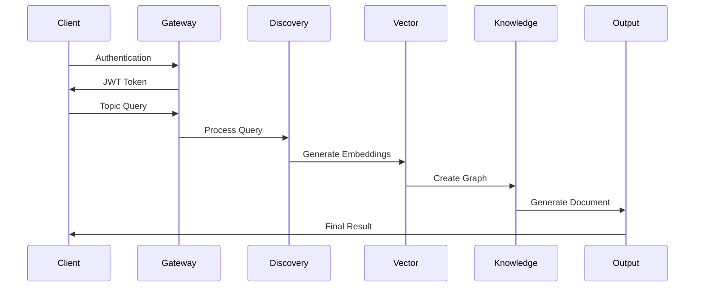

### 3.3.2 Endpoint Specifications

| Endpoint | Method | Purpose | Rate Limit |
|----------|--------|---------|------------|
| /api/v1/topics | POST | Create topic search | 10/min |
| /api/v1/content | GET | Retrieve content | 100/min |
| /api/v1/graph | GET | Fetch knowledge graph | 50/min |
| /api/v1/export | POST | Generate output | 5/min |

### 3.3.3 Integration Patterns

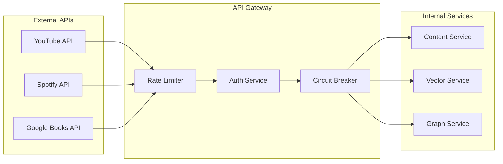

### 3.3.4 Authentication & Security

| Security Layer | Implementation | Standard |
|----------------|----------------|-----------|
| Authentication | JWT with RSA-256 | OAuth 2.0 |
| Authorization | RBAC with scopes | Custom roles |
| API Security | TLS 1.3, CORS | OWASP Top 10 |
| Rate Limiting | Token bucket | 1000/hour/user |
| Input Validation | JSON Schema | OpenAPI 3.0 |

# 4. TECHNOLOGY STACK

## 4.1 PROGRAMMING LANGUAGES

| Platform/Component | Language | Version | Justification |
|-------------------|----------|---------|---------------|
| Backend Services | Python | 3.11+ | - Native AI/ML library support<br>- Extensive NLP packages<br>- High performance with asyncio |
| API Gateway | Node.js | 20 LTS | - Efficient request handling<br>- Native JSON processing<br>- Large middleware ecosystem |
| Frontend | TypeScript | 5.0+ | - Type safety for complex state management<br>- Enhanced developer productivity<br>- Better maintainability |
| Data Processing | Python | 3.11+ | - Pandas/NumPy ecosystem<br>- Vector computation libraries<br>- Parallel processing capabilities |
| DevOps Scripts | Go | 1.21+ | - Fast execution<br>- Cross-platform compatibility<br>- Strong concurrency support |

## 4.2 FRAMEWORKS & LIBRARIES

### 4.2.1 Core Frameworks

| Component | Framework | Version | Purpose |
|-----------|-----------|---------|----------|
| Backend API | FastAPI | 0.104+ | - High-performance async support<br>- Automatic OpenAPI docs<br>- Native Pydantic integration |
| Frontend | React | 18+ | - Component reusability<br>- Virtual DOM performance<br>- Rich ecosystem |
| Vector Processing | PyTorch | 2.1+ | - GPU acceleration<br>- Production-ready inference<br>- Extensive model support |
| Knowledge Graphs | NetworkX | 3.1+ | - Graph algorithms<br>- Visualization integration<br>- Scientific computing support |

### 4.2.2 Supporting Libraries

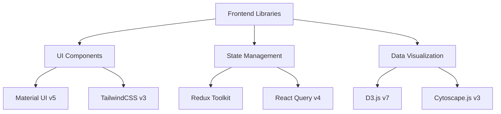

## 4.3 DATABASES & STORAGE

### 4.3.1 Primary Databases

| Database Type | Technology | Version | Use Case |
|--------------|------------|---------|-----------|
| Vector DB | Pinecone | Enterprise | - Semantic search<br>- Similarity matching<br>- Content clustering |
| Graph DB | Neo4j | 5+ Enterprise | - Knowledge relationships<br>- Graph traversal<br>- Pattern matching |
| Document DB | MongoDB | 7.0+ | - User data<br>- Content metadata<br>- System configuration |

### 4.3.2 Caching Strategy

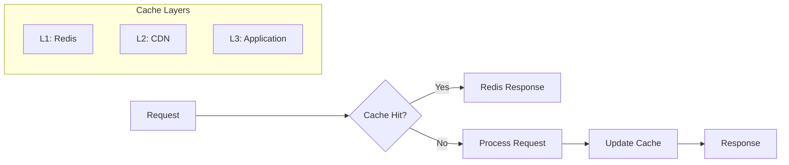

## 4.4 THIRD-PARTY SERVICES

| Category | Service | Purpose | Integration Method |
|----------|---------|---------|-------------------|
| Authentication | Auth0 | User management | OAuth 2.0/OIDC |
| Content APIs | YouTube Data API v3 | Video content | REST API |
| Content APIs | Spotify Web API | Audio content | REST API |
| Content APIs | Google Books API | Text content | REST API |
| Monitoring | Datadog | System monitoring | Agent-based |
| Error Tracking | Sentry | Error reporting | SDK integration |
| CDN | Cloudflare | Content delivery | DNS/proxy |

## 4.5 DEVELOPMENT & DEPLOYMENT

### 4.5.1 Development Environment

| Tool | Version | Purpose |
|------|---------|----------|
| Docker | 24+ | Containerization |
| Kubernetes | 1.28+ | Container orchestration |
| Terraform | 1.6+ | Infrastructure as code |
| GitHub Actions | N/A | CI/CD pipeline |

### 4.5.2 Deployment Pipeline

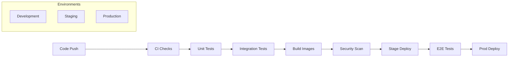

### 4.5.3 Infrastructure Requirements

| Resource | Specification | Scaling Strategy |
|----------|--------------|------------------|
| API Servers | t3.xlarge | Horizontal auto-scaling |
| Vector DB | r6g.2xlarge | Vertical scaling |
| Graph DB | r6g.4xlarge | Read replicas |
| Cache Nodes | r6g.xlarge | Cluster mode |
| Load Balancers | Application LB | Cross-zone |

# 5. SYSTEM DESIGN

## 5.1 User Interface Design

### 5.1.1 Layout Structure

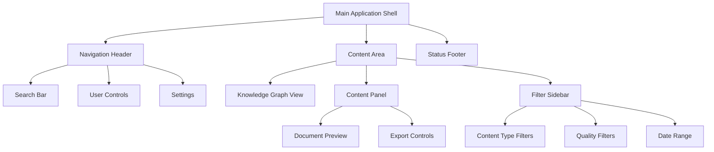

### 5.1.2 Component Specifications

| Component | Description | Interactions | States |
|-----------|-------------|--------------|---------|
| Search Bar | Expandable input with autocomplete | - Type to search<br>- Click suggestions<br>- Clear input | - Empty<br>- Typing<br>- Loading<br>- Results |
| Knowledge Graph | Interactive D3.js visualization | - Zoom/Pan<br>- Node selection<br>- Edge highlighting | - Loading<br>- Empty<br>- Active<br>- Selected |
| Content Panel | Sliding panel with content preview | - Expand/Collapse<br>- Scroll content<br>- Export options | - Collapsed<br>- Expanded<br>- Loading |
| Filter Sidebar | Collapsible filter controls | - Toggle filters<br>- Range selection<br>- Reset all | - Expanded<br>- Collapsed<br>- Filtering |

### 5.1.3 Responsive Behavior

| Breakpoint | Layout Changes | Component Behavior |
|------------|----------------|-------------------|
| Mobile (<640px) | - Stack layout<br>- Hidden sidebar<br>- Full-width panels | - Drawer navigation<br>- Simplified graph<br>- Bottom sheets |
| Tablet (640-1024px) | - Split layout<br>- Collapsible sidebar<br>- Flexible panels | - Slide-out panels<br>- Basic graph<br>- Modal dialogs |
| Desktop (>1024px) | - Three-column layout<br>- Persistent sidebar<br>- Fixed panels | - Full interactions<br>- Complex graph<br>- Inline panels |

## 5.2 Database Design

### 5.2.1 Schema Design

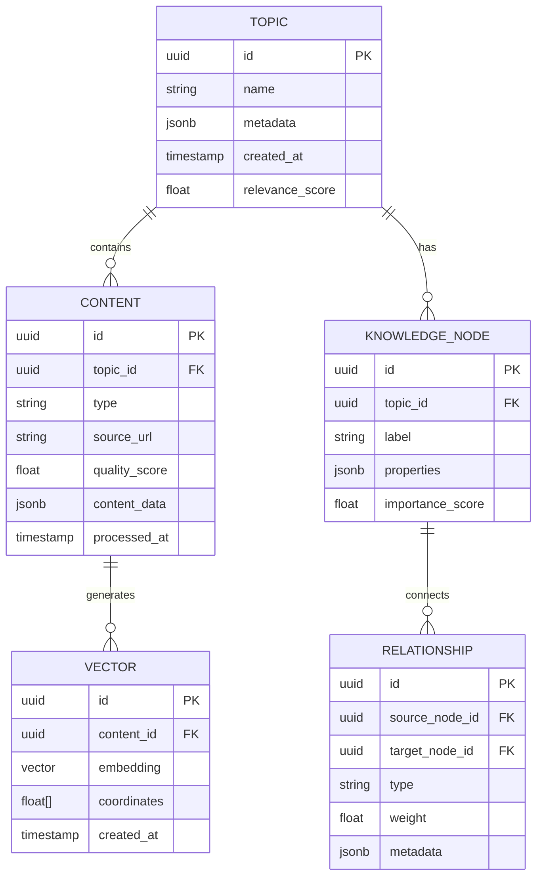

### 5.2.2 Storage Strategy

| Database Type | Technology | Purpose | Scaling Approach |
|---------------|------------|---------|------------------|
| Vector Store | Pinecone | Content embeddings | Horizontal sharding |
| Graph Database | Neo4j | Knowledge relationships | Read replicas |
| Document Store | MongoDB | Metadata & user data | Sharded clusters |
| Cache Layer | Redis | Query results | Redis Cluster |

## 5.3 API Design

### 5.3.1 REST Endpoints

| Endpoint | Method | Purpose | Request/Response |
|----------|--------|---------|------------------|
| /api/v1/topics | POST | Create topic search | Request: Topic metadata<br>Response: Topic ID & status |
| /api/v1/content/{topicId} | GET | Retrieve content | Request: Topic ID, filters<br>Response: Content array |
| /api/v1/graph/{topicId} | GET | Get knowledge graph | Request: Topic ID<br>Response: Graph structure |
| /api/v1/export/{topicId} | POST | Generate output | Request: Format preferences<br>Response: Document URL |

### 5.3.2 Service Communication

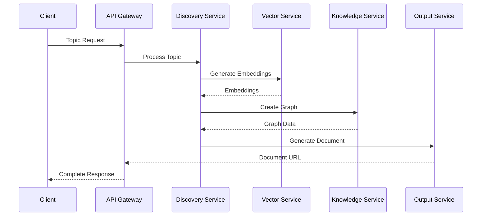

### 5.3.3 API Security

| Security Layer | Implementation | Purpose |
|----------------|----------------|---------|
| Authentication | JWT tokens | Identity verification |
| Authorization | RBAC | Access control |
| Rate Limiting | Token bucket | Request throttling |
| Input Validation | JSON Schema | Request validation |
| API Versioning | URL prefixing | Backward compatibility |

# 6. USER INTERFACE DESIGN

## 6.1 Layout Structure

### 6.1.1 Main Application Shell

```
+----------------------------------------------------------+
|                      Knowledge Curator                     |
+--[=]---[#]------------[...]-------------[@]------[?]------+
|        |                                                  |
|  +-----+------------------+  +-------------------------+  |
|  |     Topic Explorer     |  |    Knowledge Graph     |  |
|  |                        |  |                        |  |
|  | [Search Topics...]     |  |    [Interactive D3     |  |
|  |                        |  |     Visualization]     |  |
|  | Recent:               |  |                        |  |
|  | - Machine Learning    |  |     [Zoom: + -]        |  |
|  | - Quantum Computing   |  |                        |  |
|  |                        |  |     [Reset View]       |  |
|  +------------------------+  +-------------------------+  |
|                                                         |
|  +------------------------+  +-------------------------+  |
|  |    Content Panel      |  |    Export Options      |  |
|  |                        |  |                        |  |
|  | Sources:              |  | Format: [v]            |  |
|  | [ ] Videos            |  | - Notion               |  |
|  | [ ] Articles          |  | - Markdown             |  |
|  | [ ] Podcasts          |  | - PDF                  |  |
|  |                        |  |                        |  |
|  | Quality: [====----]    |  | [Generate Document]    |  |
|  +------------------------+  +-------------------------+  |
+----------------------------------------------------------+
```

### 6.1.2 Search Interface

```
+----------------------------------------------------------+
|                     Topic Search                          |
+----------------------------------------------------------+
| [....................................................]   |
| [Recent Searches]                                         |
|                                                          |
| Suggested Topics:                                        |
| +------------------------+  +-------------------------+   |
| |  Machine Learning [*]  |  |  Data Science         |   |
| +------------------------+  +-------------------------+   |
| +------------------------+  +-------------------------+   |
| |  Neural Networks      |  |  Deep Learning         |   |
| +------------------------+  +-------------------------+   |
|                                                          |
| Filters:                                                 |
| Depth: (o) Basic ( ) Intermediate ( ) Advanced           |
| Content Types: [v]                                       |
| Time Range: [Last 6 Months v]                           |
+----------------------------------------------------------+
```

### 6.1.3 Knowledge Graph View

```
+----------------------------------------------------------+
|                    Knowledge Graph                         |
+----------------------------------------------------------+
|  Controls:  [+] Zoom  [-] Zoom  [Reset]  [Full Screen]    |
|                                                           |
|  +---------------------------------------------------+   |
|  |                                                    |   |
|  |    [Node 1] -------- [Node 2]                     |   |
|  |        |               |                          |   |
|  |        |               |                          |   |
|  |    [Node 3] -------- [Node 4]                     |   |
|  |                        |                          |   |
|  |                     [Node 5]                      |   |
|  |                                                    |   |
|  +---------------------------------------------------+   |
|                                                           |
|  Legend:                                                  |
|  [*] Core Concepts   [o] Related Topics                   |
|  [!] Prerequisites   [+] Expansions                       |
+----------------------------------------------------------+
```

## 6.2 Component Specifications

### 6.2.1 Icon Key
- [=] Main Menu
- [#] Dashboard
- [@] User Profile
- [?] Help
- [*] Favorite/Important
- [!] Warning/Required
- [+] Add/Expand
- [-] Remove/Collapse
- [v] Dropdown
- [...] Search/Text Input
- [ ] Checkbox
- (o) Radio Button Selected
- ( ) Radio Button Unselected

### 6.2.2 Interactive Elements

```
+----------------------------------------------------------+
|                  Component Interactions                    |
+----------------------------------------------------------+
| Buttons:                                                  |
| [Primary Button]  [Secondary Button]  [Disabled Button]   |
|                                                          |
| Inputs:                                                  |
| Text: [......................]                           |
| Number: [123]                                            |
| Select: [Option 1 v]                                     |
|                                                          |
| Toggle Controls:                                         |
| Enable Feature: [ON] [OFF]                               |
| Options: (o) Option 1  ( ) Option 2  ( ) Option 3        |
|                                                          |
| Progress Indicators:                                     |
| Loading: [====----]  Processing: [==------]              |
+----------------------------------------------------------+
```

## 6.3 Responsive Behavior

### 6.3.1 Mobile Layout (<640px)
```
+------------------+
|  Knowledge App   |
+--[=]-----[@]----+
|                 |
| [...........] |
|                 |
| [Topics v]      |
|                 |
| +-------------+ |
| | Graph View  | |
| | (Simplified)| |
| +-------------+ |
|                 |
| [Content List]  |
| [Export v]      |
+------------------+
```

### 6.3.2 Tablet Layout (640-1024px)
```
+--------------------------------+
|        Knowledge App           |
+--[=]----[...]----[@]----[?]---+
|                               |
| +------------+ +------------+ |
| |   Topics   | |   Graph    | |
| |            | |            | |
| |            | |            | |
| +------------+ +------------+ |
|                               |
| +------------+ +------------+ |
| |  Content   | |   Export   | |
| |            | |            | |
| +------------+ +------------+ |
+--------------------------------+
```

## 6.4 State Management

### 6.4.1 Loading States
```
+----------------------------------------------------------+
|                    Loading States                         |
+----------------------------------------------------------+
| Initial Load:                                             |
| [====----] Loading Knowledge Graph                        |
|                                                          |
| Content Processing:                                      |
| [======--] Analyzing Sources                             |
|                                                          |
| Export Generation:                                       |
| [========] Creating Document                             |
|                                                          |
| Error State:                                             |
| [!] Unable to connect to server                          |
| [Retry] [Cancel]                                         |
+----------------------------------------------------------+
```

### 6.4.2 User Notifications
```
+----------------------------------------------------------+
|                   Notification Center                     |
+----------------------------------------------------------+
| [!] New content available for "Machine Learning"          |
| [i] Export completed successfully                         |
| [*] Topic analysis complete                              |
|                                                          |
| Settings:                                                |
| [ ] Email notifications                                  |
| [ ] Desktop notifications                                |
| [ ] In-app notifications                                 |
+----------------------------------------------------------+
```

# 7. SECURITY CONSIDERATIONS

## 7.1 AUTHENTICATION AND AUTHORIZATION

### 7.1.1 Authentication Flow

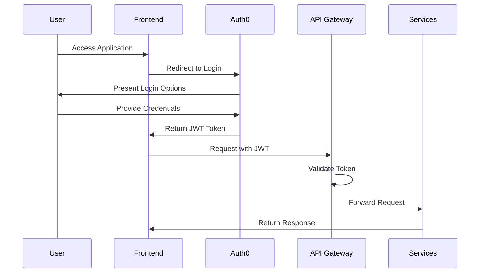

### 7.1.2 Authorization Matrix

| Role | Content Access | Vector Operations | Knowledge Graph | Export | Admin Functions |
|------|---------------|-------------------|-----------------|--------|-----------------|
| Anonymous | Read Public | Basic Search | View Only | No | No |
| Basic User | Read All | Full Search | View & Navigate | Basic Formats | No |
| Premium User | Read All | Advanced Search | Full Interactive | All Formats | No |
| Content Manager | Read/Write | Full Search | Full Interactive | All Formats | Content Only |
| Administrator | Full Access | Full Access | Full Access | Full Access | Full Access |

## 7.2 DATA SECURITY

### 7.2.1 Data Classification

| Data Type | Classification | Storage Requirements | Encryption Level |
|-----------|---------------|---------------------|------------------|
| User Credentials | Critical | Encrypted at rest | AES-256 |
| Content Vectors | Sensitive | Encrypted at rest | AES-256 |
| Knowledge Graphs | Internal | Encrypted at rest | AES-256 |
| Public Content | Public | Standard storage | TLS in transit |
| Usage Analytics | Internal | Encrypted at rest | AES-256 |

### 7.2.2 Encryption Strategy

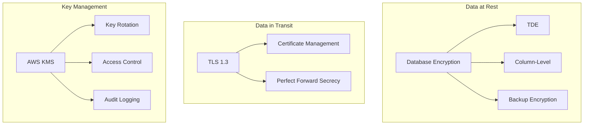

## 7.3 SECURITY PROTOCOLS

### 7.3.1 Security Standards Compliance

| Standard | Implementation | Validation Method |
|----------|---------------|-------------------|
| OWASP Top 10 | Security controls for all identified risks | Quarterly security audits |
| GDPR | Data privacy controls and user consent management | Annual compliance review |
| SOC 2 | Security and availability controls | External audit |
| ISO 27001 | Information security management system | Annual certification |

### 7.3.2 Security Monitoring

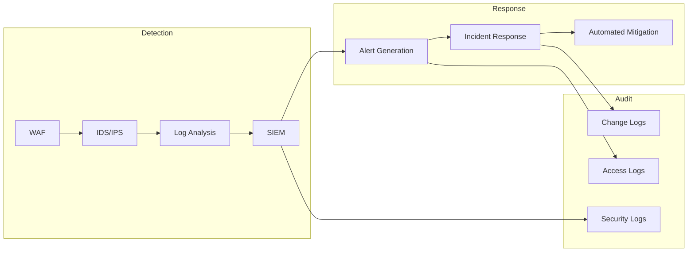

### 7.3.3 Security Controls

| Control Type | Implementation | Update Frequency |
|--------------|----------------|------------------|
| Input Validation | Server-side validation, SQL injection prevention | Real-time |
| Rate Limiting | Token bucket algorithm, 1000 requests/hour/user | Configurable |
| Session Management | 30-minute timeout, secure cookie flags | Per session |
| API Security | OAuth 2.0, API keys, request signing | Key rotation every 90 days |
| Vulnerability Scanning | Automated daily scans, penetration testing | Daily/Quarterly |

### 7.3.4 Incident Response Plan

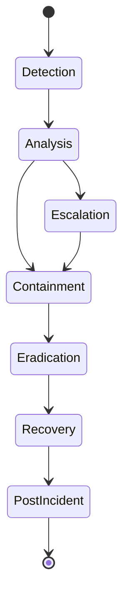

### 7.3.5 Security Update Management

| Component | Update Type | Frequency | Validation Process |
|-----------|-------------|-----------|-------------------|
| System Dependencies | Security patches | Weekly | Automated testing |
| Container Images | Base image updates | Monthly | Security scan |
| SSL Certificates | Certificate renewal | 60 days before expiry | Automated validation |
| Security Policies | Policy review | Quarterly | Compliance check |
| Access Controls | Permission audit | Monthly | Access review |

# 8. INFRASTRUCTURE

## 8.1 DEPLOYMENT ENVIRONMENT

| Environment Type | Purpose | Configuration |
|-----------------|---------|---------------|
| Development | Local development and testing | Docker containers on developer machines |
| Staging | Pre-production testing | Kubernetes cluster in cloud region |
| Production | Live system operation | Multi-region Kubernetes deployment |
| DR Site | Disaster recovery | Hot standby in alternate region |

### Environment Specifications

```mermaid
flowchart TB
    subgraph Production
        A[Primary Region] --> B[Load Balancer]
        B --> C[K8s Cluster]
        C --> D[(Primary DB)]
        
        E[Secondary Region] --> F[Load Balancer]
        F --> G[K8s Cluster]
        G --> H[(Replica DB)]
        
        D <-.-> H
    end
    
    subgraph Development
        I[Local Dev] --> J[Docker Desktop]
        K[CI Environment] --> L[Test Cluster]
    end
    
    A <-.-> E
```

## 8.2 CLOUD SERVICES

| Service Category | AWS Service | Purpose | Configuration |
|-----------------|-------------|---------|---------------|
| Compute | EKS | Kubernetes orchestration | Production: 3 node groups<br>Staging: 1 node group |
| Database | DocumentDB | MongoDB-compatible database | Multi-AZ deployment |
| Vector Storage | MSK | Kafka for event streaming | 3 broker cluster |
| Caching | ElastiCache | Redis caching layer | Cluster mode enabled |
| Storage | S3 | Object storage | Versioning enabled |
| CDN | CloudFront | Content delivery | Global edge locations |
| Security | KMS | Key management | Automatic rotation |

### Service Architecture

```mermaid
flowchart LR
    subgraph Compute
        A[EKS Cluster] --> B[Node Group 1]
        A --> C[Node Group 2]
        A --> D[Node Group 3]
    end
    
    subgraph Storage
        E[(DocumentDB)] --> F[(Replica)]
        G[S3 Bucket] --> H[CloudFront]
        I[(ElastiCache)] --> J[(Redis Replica)]
    end
    
    subgraph Network
        K[Route53] --> L[ALB]
        L --> A
    end
```

## 8.3 CONTAINERIZATION

### Container Strategy

| Component | Base Image | Resource Limits |
|-----------|------------|-----------------|
| API Gateway | node:20-alpine | CPU: 1 core<br>Memory: 2Gi |
| Content Service | python:3.11-slim | CPU: 2 cores<br>Memory: 4Gi |
| Vector Service | python:3.11-slim | CPU: 4 cores<br>Memory: 8Gi |
| Knowledge Service | python:3.11-slim | CPU: 2 cores<br>Memory: 4Gi |
| Output Service | node:20-alpine | CPU: 1 core<br>Memory: 2Gi |

### Multi-Stage Builds

```dockerfile
# Example for Vector Service
FROM python:3.11-slim as builder
WORKDIR /app
COPY requirements.txt .
RUN pip install --user -r requirements.txt

FROM python:3.11-slim
COPY --from=builder /root/.local /root/.local
COPY . .
ENV PATH=/root/.local/bin:$PATH
CMD ["uvicorn", "main:app", "--host", "0.0.0.0"]
```

## 8.4 ORCHESTRATION

### Kubernetes Configuration

```mermaid
flowchart TB
    subgraph Cluster
        A[Ingress Controller] --> B[API Gateway]
        B --> C[Services]
        
        subgraph Services
            D[Content Pod]
            E[Vector Pod]
            F[Knowledge Pod]
            G[Output Pod]
        end
        
        subgraph Storage
            H[(PVC)]
            I[ConfigMap]
            J[Secrets]
        end
    end
    
    C --> H
    C --> I
    C --> J
```

### Resource Management

| Resource Type | Request | Limit | Autoscaling |
|--------------|---------|-------|-------------|
| API Gateway | 0.5 CPU, 1Gi Mem | 1 CPU, 2Gi Mem | 3-10 replicas |
| Content Service | 1 CPU, 2Gi Mem | 2 CPU, 4Gi Mem | 2-8 replicas |
| Vector Service | 2 CPU, 4Gi Mem | 4 CPU, 8Gi Mem | 2-6 replicas |
| Knowledge Service | 1 CPU, 2Gi Mem | 2 CPU, 4Gi Mem | 2-8 replicas |
| Output Service | 0.5 CPU, 1Gi Mem | 1 CPU, 2Gi Mem | 2-6 replicas |

## 8.5 CI/CD PIPELINE

### Pipeline Stages

```mermaid
flowchart LR
    A[Code Push] --> B[Lint & Test]
    B --> C[Build Images]
    C --> D[Security Scan]
    D --> E[Deploy Staging]
    E --> F[Integration Tests]
    F --> G[Deploy Production]
    G --> H[Health Check]
    
    subgraph Automation
        I[GitHub Actions]
        J[ArgoCD]
        K[Prometheus]
    end
    
    I --> B
    I --> C
    J --> E
    J --> G
    K --> H
```

### Deployment Strategy

| Stage | Strategy | Rollback Time | Validation |
|-------|----------|---------------|------------|
| Staging | Blue/Green | < 1 minute | Integration tests |
| Production | Rolling update | < 5 minutes | Health probes |
| Canary | 10% traffic | < 30 seconds | Metrics analysis |
| Feature flags | Per-feature | Immediate | A/B testing |

### Pipeline Tools

| Tool | Purpose | Integration |
|------|---------|-------------|
| GitHub Actions | CI automation | Source control |
| ArgoCD | GitOps deployment | Kubernetes |
| Helm | Package management | Kubernetes |
| Prometheus | Metrics & monitoring | Kubernetes |
| Grafana | Visualization | Prometheus |
| SonarQube | Code quality | GitHub Actions |
| Trivy | Container scanning | GitHub Actions |

# APPENDICES

## A.1 Additional Technical Information

### A.1.1 Initial Research Mode Specifications

| Phase | Duration | Processing Details |
|-------|----------|-------------------|
| Deep Research | 5-10 mins | - Comprehensive API querying across all sources<br>- Multiple filtering passes<br>- Quality assessment iterations |
| Content Analysis | 3-5 mins | - Advanced clustering<br>- Relationship mapping<br>- Gap identification |
| Knowledge Synthesis | 2-3 mins | - Meta-model application<br>- Structure optimization<br>- Citation verification |

### A.1.2 Caching Strategy

```mermaid
flowchart TB
    subgraph Cache Layers
        L1[Memory Cache]
        L2[Redis Cache]
        L3[CDN Cache]
    end
    
    subgraph TTL Strategy
        T1[Hot Data: 1 hour]
        T2[Warm Data: 24 hours]
        T3[Cold Data: 7 days]
    end
    
    L1 --> T1
    L2 --> T2
    L3 --> T3
```

## A.2 GLOSSARY

| Term | Definition |
|------|------------|
| Meta-model | Framework for organizing knowledge hierarchically and establishing relationships between concepts |
| Vector Embedding | High-dimensional numerical representation of content that captures semantic meaning |
| Semantic Search | Search methodology using contextual meaning rather than exact keyword matching |
| Knowledge Graph | Network representation of information showing relationships between entities and concepts |
| Content Curation | Process of discovering, gathering, and organizing content based on quality and relevance |
| Token Bucket | Rate limiting algorithm that controls the rate of processing requests |
| Hot Standby | Backup system that maintains real-time synchronization with the primary system |
| Circuit Breaker | Design pattern that prevents system failure by detecting and stopping problematic operations |
| Blue/Green Deployment | Deployment strategy using two identical environments for zero-downtime updates |
| Canary Release | Deployment technique that gradually rolls out changes to a subset of users |

## A.3 ACRONYMS

| Acronym | Full Form |
|---------|-----------|
| API | Application Programming Interface |
| RBAC | Role-Based Access Control |
| JWT | JSON Web Token |
| TLS | Transport Layer Security |
| CDN | Content Delivery Network |
| ECC | Error-Correcting Code |
| CUDA | Compute Unified Device Architecture |
| SR-IOV | Single Root I/O Virtualization |
| QPS | Queries Per Second |
| MTBF | Mean Time Between Failures |
| MTTR | Mean Time To Recovery |
| RPO | Recovery Point Objective |
| RTO | Recovery Time Objective |
| AVX | Advanced Vector Extensions |
| NVMe | Non-Volatile Memory Express |
| ELK | Elasticsearch, Logstash, Kibana |

## A.4 System Health Monitoring

```mermaid
flowchart LR
    subgraph Metrics Collection
        A[System Metrics] --> B[Prometheus]
        C[Business Metrics] --> B
        D[Custom Metrics] --> B
    end
    
    subgraph Visualization
        B --> E[Grafana Dashboards]
        E --> F[Alerts]
        E --> G[Reports]
    end
    
    subgraph Response
        F --> H[PagerDuty]
        F --> I[Auto-scaling]
        F --> J[Circuit Breaking]
    end
```

## A.5 Error Handling Matrix

| Error Type | Detection Method | Response Strategy | Recovery Action |
|------------|-----------------|-------------------|-----------------|
| API Timeout | Circuit Breaker | Fallback to Cache | Retry with Exponential Backoff |
| Data Corruption | Checksum Validation | Use Backup Data | Trigger Replication Sync |
| Rate Limiting | Token Bucket | Queue Requests | Implement Request Throttling |
| Memory Overflow | Resource Monitor | Clear Cache | Scale Horizontally |
| Network Partition | Heartbeat Check | Switch to DR Site | Repair Network Connection |