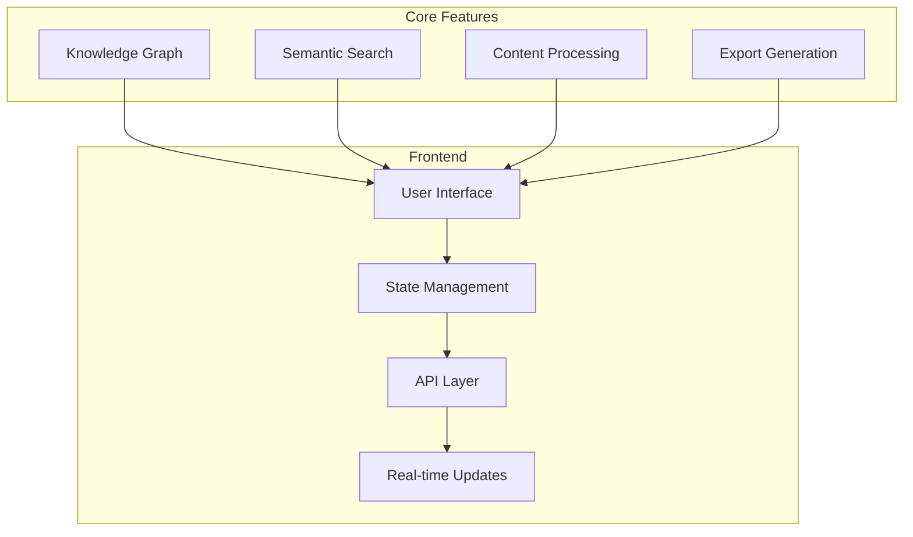
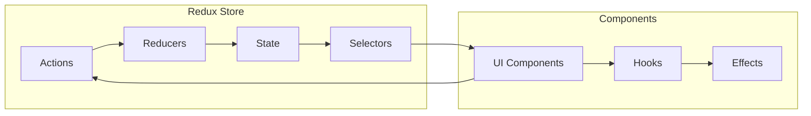

# Knowledge Curator Web Frontend

A sophisticated AI-powered knowledge aggregation and curation system that transforms scattered information into structured, digestible knowledge using advanced vector databases, semantic search, and interactive knowledge graphs.

## Table of Contents
- [Overview](#overview)
- [Features](#features)
- [Technology Stack](#technology-stack)
- [Getting Started](#getting-started)
- [Development](#development)
- [Testing](#testing)
- [Deployment](#deployment)
- [Troubleshooting](#troubleshooting)

## Overview

The Knowledge Curator frontend provides an intuitive interface for knowledge discovery, organization, and visualization. It leverages cutting-edge web technologies to deliver a responsive, accessible, and performant user experience.

### System Architecture



### Key Features
- Interactive knowledge graph visualization
- Real-time semantic search capabilities
- Multi-source content aggregation
- Personalized learning paths
- Export to multiple formats
- Collaborative knowledge curation
- Advanced filtering and organization

## Technology Stack

### Core Technologies
- **Framework**: React 18+ with TypeScript 5.0+
- **UI Components**: Material UI v5
- **Styling**: TailwindCSS v3
- **State Management**: Redux Toolkit
- **API Integration**: React Query v4
- **Visualization**: D3.js v7, Cytoscape.js v3
- **Real-time**: Socket.io v4
- **Testing**: Jest 29+, React Testing Library, Cypress 12+

### Development Tools
- **Build**: Vite 4+
- **Linting**: ESLint 8+
- **Formatting**: Prettier 2+
- **Container**: Docker 24+
- **Package Manager**: pnpm 8+

## Getting Started

### Prerequisites
- Node.js 20 LTS
- pnpm 8+
- Docker 24+ and Docker Compose (for containerized development)
- Git 2.3+

### Environment Setup

1. Clone the repository:
```bash
git clone <repository-url>
cd src/web
```

2. Install dependencies:
```bash
pnpm install
```

3. Configure environment variables:
```bash
cp .env.example .env.local
```

4. Start development server:
```bash
# With Docker
docker-compose up -d

# Without Docker
pnpm dev
```

### IDE Setup

#### VS Code Recommended Extensions
- ESLint
- Prettier
- TypeScript and JavaScript Language Features
- Material Icon Theme
- Tailwind CSS IntelliSense
- Jest Runner
- Mermaid Preview

## Development

### Project Structure
```
src/
├── components/       # Reusable UI components
├── features/        # Feature-specific components
├── hooks/           # Custom React hooks
├── services/        # API and external services
├── store/           # Redux store configuration
├── styles/          # Global styles and themes
├── types/           # TypeScript type definitions
├── utils/           # Utility functions
└── views/           # Page components
```

### Coding Standards

#### TypeScript Best Practices
- Enable strict mode in `tsconfig.json`
- Use explicit type annotations for function parameters
- Leverage interface inheritance for reusable types
- Implement proper error handling with custom types

#### Component Development
- Follow atomic design principles
- Implement proper prop typing
- Use React.memo for performance optimization
- Implement error boundaries
- Follow accessibility guidelines (WCAG 2.1)

### State Management



## Testing

### Testing Strategy
- Unit tests for utilities and hooks
- Component tests with React Testing Library
- Integration tests for feature flows
- E2E tests with Cypress
- Visual regression testing
- Performance testing with Lighthouse

### Running Tests
```bash
# Unit and integration tests
pnpm test

# E2E tests
pnpm test:e2e

# Coverage report
pnpm test:coverage
```

## Deployment

### Build Process
```bash
# Production build
pnpm build

# Preview build
pnpm preview
```

### Docker Production Build
```dockerfile
# Multi-stage build process
FROM node:20-alpine as builder
WORKDIR /app
COPY package.json pnpm-lock.yaml ./
RUN pnpm install --frozen-lockfile
COPY . .
RUN pnpm build

FROM nginx:alpine
COPY --from=builder /app/dist /usr/share/nginx/html
COPY nginx.conf /etc/nginx/conf.d/default.conf
EXPOSE 80
CMD ["nginx", "-g", "daemon off;"]
```

### Environment Configuration
- `VITE_API_URL`: Backend API endpoint
- `VITE_WS_URL`: WebSocket server URL
- `VITE_ENVIRONMENT`: Deployment environment
- `VITE_SENTRY_DSN`: Error tracking
- `VITE_ANALYTICS_ID`: Analytics tracking

## Troubleshooting

### Common Issues

#### Development Server
- Port conflicts: Check for running processes on port 3000
- Dependencies issues: Clear pnpm cache and node_modules
- Environment variables: Verify .env.local configuration

#### Build Problems
- TypeScript errors: Run `pnpm type-check`
- Linting issues: Run `pnpm lint`
- Bundle size warnings: Analyze with `pnpm analyze`

#### Performance
- React DevTools profiler for component optimization
- Chrome DevTools Performance tab for runtime analysis
- Lighthouse for overall performance metrics

### Debug Strategies
1. Enable source maps in development
2. Use React DevTools
3. Implement proper error boundaries
4. Enable detailed logging in development
5. Use browser developer tools

## Contributing

Please refer to [CONTRIBUTING.md](./CONTRIBUTING.md) for detailed guidelines on:
- Code style and formatting
- Branch naming conventions
- Commit message format
- Pull request process
- Code review requirements

## License

This project is licensed under the MIT License - see the [LICENSE](./LICENSE) file for details.